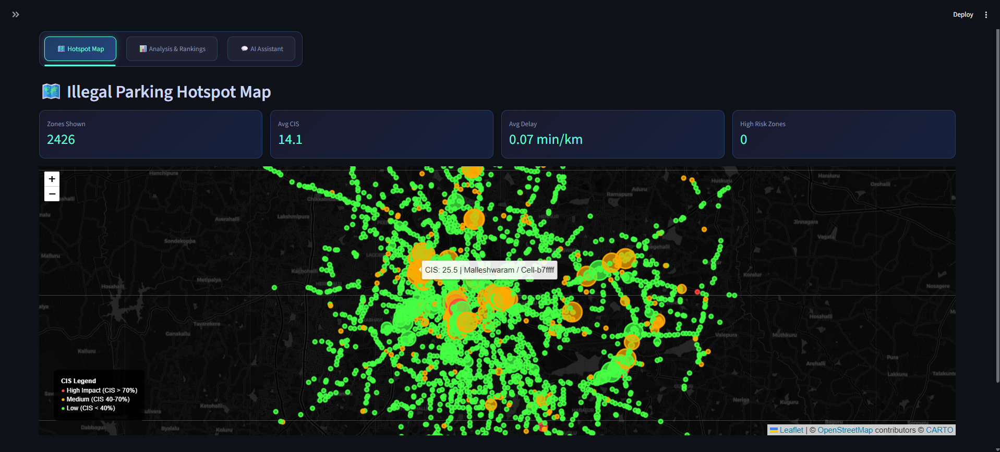
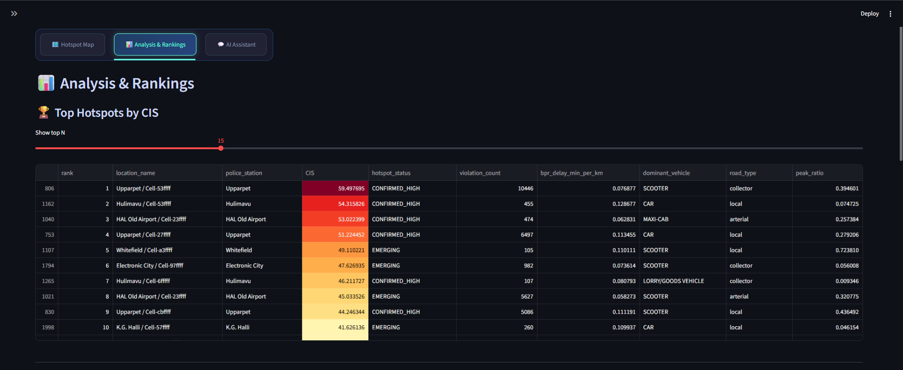
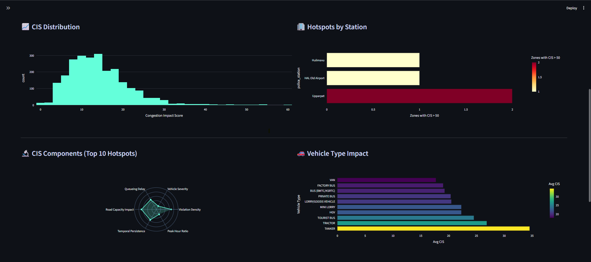
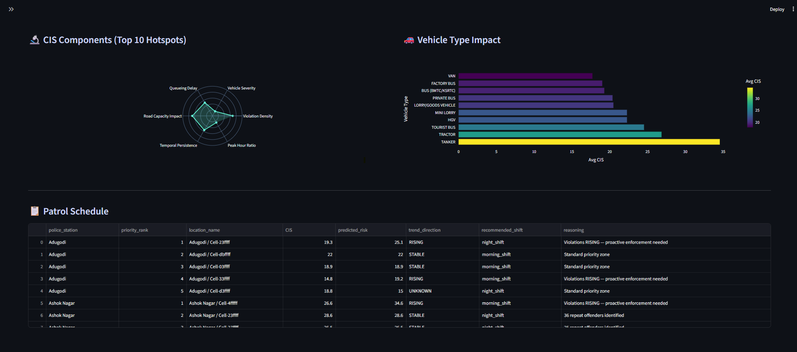
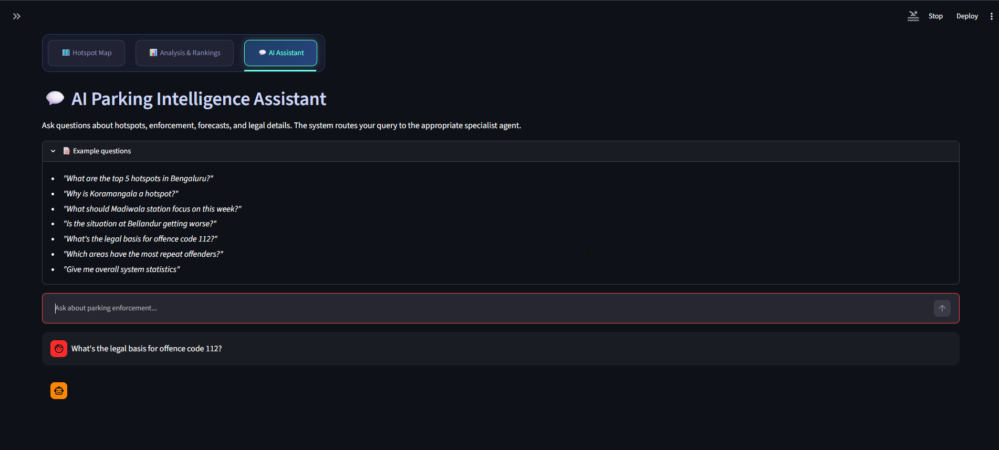
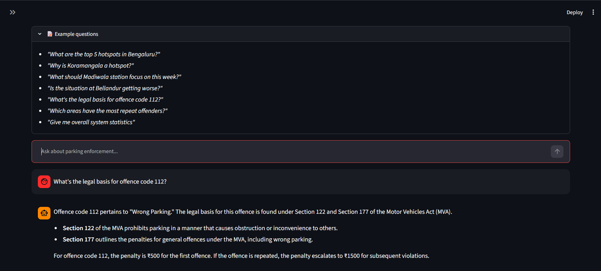
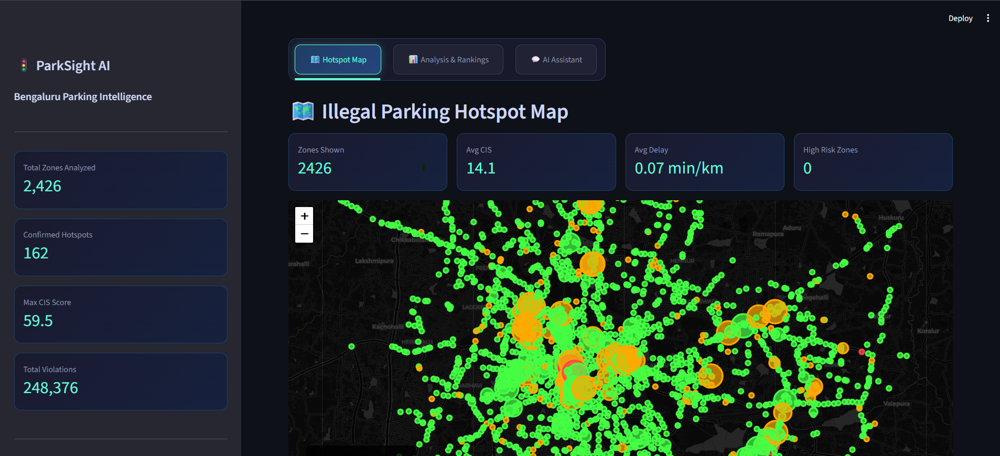
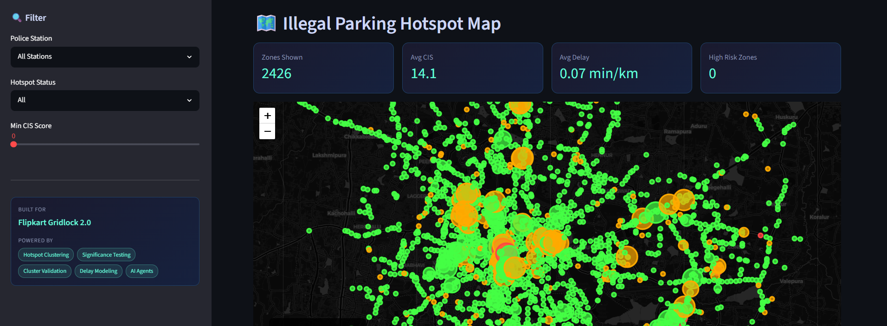

# ParkSight AI — Bengaluru Parking Congestion Intelligence

<div align="center">



**Flipkart Gridlock 2.0 Hackathon Submission**

[](https://python.org)
[](https://streamlit.io)
[](https://langchain-ai.github.io/langgraph/)
[](https://openai.com)

</div>

---

## 🚨 Problem Statement

Bengaluru loses **₹200 crore per day** in productivity due to traffic congestion. A critical but under-studied contributor is **illegal parking on arterial and collector roads**, which:

- Reduces effective lane capacity by 30–50%
- Creates secondary bottlenecks at junctions
- Forces vehicles into U-turns and detours, amplifying congestion
- Concentrates disproportionately at predictable, repeat locations

The challenge: given **298,450 parking violation records** from Bengaluru's camera enforcement network (Nov 2023 – Apr 2024), can we:

1. Identify **where** illegal parking creates the most congestion?
2. Quantify **how much** delay it causes in measurable traffic engineering terms?
3. **Predict** which zones will worsen next week?
4. Help police stations **deploy officers** to the highest-impact locations at the right times?

---

## 💡 Our Solution: ParkSight AI

A **7-phase data science pipeline** + **6-agent AI system** that transforms raw violation logs into actionable enforcement intelligence.

### What makes this different from a heatmap:

| Heatmap Approach | ParkSight AI |
|---|---|
| Shows where violations are frequent | Shows where violations **cause congestion** |
| Raw counts → biased by camera density | **Device-normalized** λ (violations per unique camera) |
| No statistical validation | **Gi* + Moran's I cross-validated** hotspots |
| No time dimension | **ST-DBSCAN** finds spatiotemporal recurring clusters |
| No congestion quantification | **BPR Volume-Delay Function** → minutes of delay per km |
| No forecasting | **Prophet** predicts next-week risk per zone |
| Static report | **GPT-4o agents** answer natural language enforcement questions |

---

## 🏗️ Architecture

### Pipeline (7 Phases)

```
dataset.csv (298K violations)
     │
     ▼
┌─────────────────────────────────────────────────────────────┐
│ Phase 1: Data Cleaning                                      │
│  • UTC → IST timezone fix (critical: peak-hour features)   │
│  • Multi-code offence parsing (e.g., "109,112" → ["109","112"])│
│  • Vehicle severity weighting                               │
└───────────────────────┬─────────────────────────────────────┘
                        │
                        ▼
┌─────────────────────────────────────────────────────────────┐
│ Phase 2: OSM Enrichment (OpenStreetMap via OSMnx v2)       │
│  • 593K road segments downloaded for Bengaluru bbox        │
│  • Spatial join → road type, lane count, capacity          │
│  • POI proximity → metro stations, shops, schools          │
└───────────────────────┬─────────────────────────────────────┘
                        │
                        ▼
┌─────────────────────────────────────────────────────────────┐
│ Phase 3: Hotspot Detection (Dual Method + Cross-Validation) │
│                                                             │
│  A) ST-DBSCAN (BallTree implementation)                    │
│     • Spatial neighbors via BallTree (eps1=200m)           │
│     • Then temporal filter (eps2=120min)                   │
│     • Finds spatiotemporal recurring clusters              │
│                                                             │
│  B) Getis-Ord Gi* + Local Moran's I (on H3 hex cells)     │
│     • KNN spatial weights (k=8, row-standardized)         │
│     • Gi* z-scores + pseudo p-values (p<0.05)             │
│     • LISA quadrant labels (HH/HL/LH/LL)                  │
│                                                             │
│  Cross-Validation:                                          │
│    All 3 agree → CONFIRMED_HIGH                            │
│    2 of 3     → CONFIRMED                                  │
│    1 of 3     → EMERGING                                   │
└───────────────────────┬─────────────────────────────────────┘
                        │
                        ▼
┌─────────────────────────────────────────────────────────────┐
│ Phase 4: Congestion Quantification                          │
│  • M/M/∞ queueing: E[N] = λ/μ (expected vehicles queued)  │
│  • BPR Volume-Delay Function:                               │
│    t = t₀ × (1 + α × (V/C)^β)  [α=0.15, β=4]            │
│  → Output: minutes of delay per km, per H3 cell            │
└───────────────────────┬─────────────────────────────────────┘
                        │
                        ▼
┌─────────────────────────────────────────────────────────────┐
│ Phase 5: Congestion Impact Score (CIS)                      │
│  Weighted composite (min-max normalized):                   │
│  CIS = 0.25×violation_density + 0.20×vehicle_severity     │
│      + 0.20×queueing_delay   + 0.15×road_capacity_impact  │
│      + 0.10×temporal_persistence + 0.10×peak_hour_ratio   │
│  + Sensitivity analysis proving ranking stability           │
└───────────────────────┬─────────────────────────────────────┘
                        │
                        ▼
┌─────────────────────────────────────────────────────────────┐
│ Phase 6: Risk Forecasting                                   │
│  • Hybrid model:                                            │
│    - Prophet (for top hotspots with ≥8 weeks of data)      │
│    - Trend-slope classification (low-data zones)           │
│  → Output: predicted_risk, trend (RISING/STABLE/FALLING)   │
└───────────────────────┬─────────────────────────────────────┘
                        │
                        ▼
┌─────────────────────────────────────────────────────────────┐
│ Phase 7: Patrol Prioritization                              │
│  • Score = CIS × predicted_risk                            │
│  • Shift recommendation (morning/evening/night)            │
│  • Plain-language reasoning per zone                       │
│  → Output: patrol_schedule.csv (54 police stations)        │
└─────────────────────────────────────────────────────────────┘
```

### Agentic Layer (LangGraph + GPT-4o)

```
User Query
    │
    ▼
┌─────────────┐
│   Router    │  ← Classifies intent
│    Node     │
└──────┬──────┘
       │
  ┌────┴────────────────────────────────┐
  │                                     │
  ▼                                     ▼
Hotspot Analyst        Impact Quantifier
(Gi*, CIS, maps)       (BPR, queueing, delay)
       │                                │
  ┌────┴────────────────────────────────┘
  │
  ├── Policy Advisor       (legal codes, fines)
  ├── Enforcement Strategist (patrol scheduling)
  ├── Forecast Analyst      (Prophet, trends)
  └── General Assistant     (multi-topic)
```

Each agent has access to 8 specialized tools that query the pre-computed pipeline outputs.

---

## 📸 Screenshots

| Dashboard Overview | Hotspot Map |
|---|---|
|  |  |

| Congestion Analytics | CIS Rankings |
|---|---|
|  |  |

| Patrol Briefs | AI Assistant |
|---|---|
|  |  |

| Station Analysis | Forecast Trends |
|---|---|
|  |  |

---

## 🛠️ Tech Stack

| Layer | Technology | Purpose |
|---|---|---|
| **Data** | Pandas, GeoPandas | Data cleaning, spatial joins |
| **Spatial** | OSMnx v2, Shapely | Road network download, POI proximity |
| **Clustering** | BallTree ST-DBSCAN | Spatiotemporal hotspot detection |
| **Statistics** | PySAL (libpysal, esda) | Gi*, Moran's I significance testing |
| **Hex Grid** | H3 (Uber) | Hexagonal cell aggregation |
| **Congestion** | BPR + M/M/∞ | Traffic delay quantification |
| **Forecasting** | Prophet | Time-series risk prediction |
| **Agents** | LangGraph + LangChain | Multi-agent orchestration |
| **LLM** | OpenAI GPT-4o | Natural language enforcement queries |
| **Dashboard** | Streamlit + Folium | Interactive web interface |
| **Visualization** | Plotly, Folium | Charts, interactive maps |

---

## 📂 Project Structure

```
round2/
├── pipeline/
│   ├── config.py              # All parameters (BPR α/β, CIS weights, etc.)
│   ├── data_cleaning.py       # Phase 1: UTC→IST, severity, multi-code parse
│   ├── osm_enrichment.py      # Phase 2: Road network + POI
│   ├── hotspot_detection.py   # Phase 3: ST-DBSCAN + Gi* + Moran's I
│   ├── queueing_model.py      # Phase 4: M/M/∞ + BPR delay
│   ├── cis_calculation.py     # Phase 5: Weighted CIS + sensitivity analysis
│   ├── forecasting.py         # Phase 6: Prophet + trend classification
│   ├── prioritization.py      # Phase 7: Patrol schedule generation
│   └── run_all.py             # Master runner (all phases sequentially)
├── agents/
│   ├── graph.py               # 6-agent LangGraph orchestrator + router
│   └── tools.py               # 8 specialist tools (query pipeline outputs)
├── dashboard/
│   └── app.py                 # Streamlit dashboard (4 tabs)
├── images/                    # Screenshot assets
├── st_dbscan/                 # Local ST-DBSCAN package
├── .env                       # API keys (not committed)
├── requirements.txt
└── README.md
```

---

## ⚡ How to Run

### Prerequisites
- Python 3.10+
- OpenAI API key (get free credits at [platform.openai.com](https://platform.openai.com))
- `dataset.csv` in the project root (provided separately — 104MB)

### Step 1: Clone & Setup

```bash
git clone https://github.com/YOUR_USERNAME/REPO_NAME.git
cd REPO_NAME

# Create virtual environment
python -m venv .venv

# Activate (Windows PowerShell)
.venv\Scripts\Activate.ps1

# Activate (Mac/Linux)
source .venv/bin/activate
```

### Step 2: Install Dependencies

```bash
pip install -r requirements.txt
pip install langchain-openai langgraph langchain-core
```

### Step 3: Configure API Key

Create a `.env` file in the project root:

```
OPENAI_API_KEY=sk-your-key-here
```

### Step 4: Run the Pipeline

Run each phase **in order**, waiting for each to complete:

```bash
# Phase 1: Data cleaning + timezone fix (~30 seconds)
python -X utf8 pipeline/data_cleaning.py

# Phase 2: OSM road network download (~5 minutes, needs internet)
python -X utf8 pipeline/osm_enrichment.py

# Phase 3: ST-DBSCAN + Gi* + Moran's I (~10-20 minutes on 248K rows)
python -X utf8 pipeline/hotspot_detection.py

# Phase 4: Queueing model + BPR delay (~1 minute)
python -X utf8 pipeline/queueing_model.py

# Phase 5: CIS calculation + sensitivity analysis (~30 seconds)
python -X utf8 pipeline/cis_calculation.py

# Phase 6: Prophet forecasting (~2-3 minutes)
python -X utf8 pipeline/forecasting.py

# Phase 7: Patrol schedule generation (~30 seconds)
python -X utf8 pipeline/prioritization.py
```

Or run everything in one command:
```bash
python pipeline/run_all.py
```

### Step 5: Launch the Dashboard

```bash
python -m streamlit run dashboard/app.py
```

Opens at **http://localhost:8501** ✅

---

## 📊 Key Results

| Metric | Value |
|---|---|
| Total violations analyzed | 248,376 |
| H3 hexagonal cells | 2,426 |
| Confirmed hotspots | (see dashboard) |
| Road segments mapped | 593,549 |
| Police stations covered | 54 |
| Avg distance to nearest road | 6.4m |
| Dataset time range | Nov 2023 – Apr 2024 |

---

## 🔬 Methodology Notes

**Why BallTree instead of the st_dbscan library?**
The `st_dbscan` library computes the full O(n²) temporal pairwise matrix before applying spatial filtering. With bursty timestamps from batch logging, this generates 275M+ entries for 100K points — an out-of-memory crash. Our BallTree implementation queries spatial neighbors first (200m radius → only ~10-100 candidates per point), then filters those by temporal distance. No global matrix is ever built.

**Why device-normalized counts?**
Areas with more cameras naturally appear to have more violations. We normalize by unique devices per H3 cell to prevent "camera density bias" from inflating CIS scores for heavily-monitored but not genuinely problematic zones.

**Why BPR volume-delay over simple counts?**
BPR (Bureau of Public Roads) is the standard traffic engineering formula used by NITI Aayog and international road planners. It converts occupancy ratios into measurable delay (minutes per km), making our results comparable across road types with different capacities.

---

## 👥 Team

Built for **Flipkart Gridlock 2.0** Hackathon — Round 2

---

## 📄 License

MIT License — see [LICENSE](LICENSE) for details.
